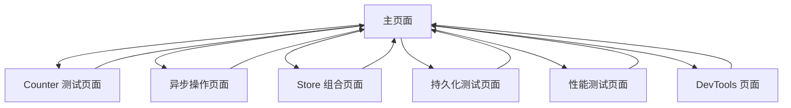

# Pinia 状态管理测试平台产品需求文档

## 1. 产品概述

本产品是一个基于 Nuxt.js 和 Pinia 的状态管理测试平台，旨在展示和验证 Pinia 状态管理库在 Nuxt 环境中的各种功能特性。

该平台为开发者提供了一个完整的测试环境，用于学习和验证 Pinia 的核心功能，包括基础状态管理、异步操作、Store 组合、数据持久化、性能优化和开发工具集成等。

## 2. 核心功能

### 2.1 用户角色

| 角色 | 访问方式 | 核心权限 |
|------|----------|----------|
| 开发者用户 | 直接访问 | 可以测试所有 Pinia 功能模块，查看状态变化，执行各种操作 |

### 2.2 功能模块

本测试平台包含以下主要页面：

1. **主页面**：功能导航、当前状态预览
2. **Counter 测试页面**：基础计数器功能、异步操作测试
3. **异步操作页面**：API 请求与状态管理测试
4. **Store 组合页面**：多个 Store 协作测试
5. **持久化测试页面**：状态持久化存储测试
6. **性能测试页面**：响应性能与优化测试
7. **DevTools 页面**：开发工具集成测试

### 2.3 页面详情

| 页面名称 | 模块名称 | 功能描述 |
|----------|----------|----------|
| 主页面 | 功能导航 | 展示所有测试模块的入口卡片，提供清晰的功能分类和导航 |
| 主页面 | 状态预览 | 实时显示 Counter Store 和 User Store 的当前状态信息 |
| Counter 测试页面 | 状态显示 | 展示当前计数值、双倍值、奇偶性、正负性等计算属性 |
| Counter 测试页面 | 基本操作 | 提供增加、减少、重置、随机值等基础操作按钮 |
| Counter 测试页面 | 自定义设置 | 支持设置具体数值和批量增加功能 |
| Counter 测试页面 | 异步操作 | 从外部 API 获取数据并更新状态，包含加载状态和错误处理 |
| Counter 测试页面 | 状态历史 | 记录和显示状态变化的历史记录 |
| 异步操作页面 | API 测试 | 测试各种异步 API 调用和状态更新 |
| 异步操作页面 | 错误处理 | 演示异步操作中的错误处理机制 |
| Store 组合页面 | 多 Store 交互 | 展示 Counter Store 和 User Store 之间的数据共享和状态同步 |
| Store 组合页面 | 状态联动 | 演示不同 Store 之间的状态联动效果 |
| 持久化测试页面 | Cookie 管理 | 使用 Nuxt useCookie API 进行状态持久化测试 |
| 持久化测试页面 | 数据导入导出 | 支持 Store 数据的导出和导入功能 |
| 性能测试页面 | 响应性能 | 测试大量数据更新时的响应性能 |
| 性能测试页面 | 优化策略 | 展示各种性能优化技巧和策略 |
| DevTools 页面 | 开发工具集成 | 测试 Pinia DevTools 的集成和调试功能 |
| DevTools 页面 | 状态调试 | 提供状态调试和时间旅行功能 |

## 3. 核心流程

### 主要用户操作流程

用户首先进入主页面，可以查看当前所有 Store 的状态概览。然后根据需要选择不同的测试模块：

- 选择 Counter 测试进行基础状态管理学习
- 选择异步操作测试了解 API 集成
- 选择 Store 组合测试学习多 Store 协作
- 选择持久化测试了解数据存储
- 选择性能测试了解优化策略
- 选择 DevTools 测试了解调试工具

每个测试页面都提供返回主页面的导航，形成完整的测试流程闭环。

## 4. 用户界面设计

### 4.1 设计风格

- **主色调**：蓝色系 (#3B82F6) 和渐变背景 (blue-50 to indigo-100)
- **辅助色彩**：绿色 (#10B981)、红色 (#EF4444)、紫色 (#8B5CF6)、橙色 (#F59E0B)
- **按钮样式**：圆角设计 (rounded-lg)，悬停效果，图标+文字组合
- **字体**：系统默认字体，标题使用 font-bold，正文使用 font-semibold
- **布局风格**：卡片式布局，网格系统，响应式设计
- **图标风格**：使用 Lucide 图标库，简洁现代的线性图标

### 4.2 页面设计概览

| 页面名称 | 模块名称 | UI 元素 |
|----------|----------|----------|
| 主页面 | 功能导航 | 3列网格布局，白色卡片，彩色图标背景，悬停阴影效果 |
| 主页面 | 状态预览 | 2列网格，灰色背景卡片，实时数据显示，颜色编码状态 |
| Counter 测试页面 | 状态显示 | 2x2网格布局，彩色背景卡片，大号数字显示，状态标签 |
| Counter 测试页面 | 操作按钮 | 2列网格，彩色按钮，图标+文字，禁用状态支持 |
| 异步操作页面 | API 测试 | 全宽按钮，加载动画，错误提示框，状态指示器 |
| Store 组合页面 | 多 Store 展示 | 3列布局，独立卡片，状态同步显示，操作按钮组 |
| 持久化测试页面 | 测试结果 | 列表布局，成功/失败状态图标，时间戳显示 |
| 性能测试页面 | 性能指标 | 仪表盘样式，进度条，数值显示，图表展示 |
| DevTools 页面 | 调试信息 | 代码块样式，JSON 格式化显示，状态树结构 |

### 4.3 响应式设计

该产品采用桌面优先的响应式设计，支持移动端适配。使用 Tailwind CSS 的响应式断点系统，确保在不同屏幕尺寸下都有良好的用户体验。主要断点包括 md (768px)、lg (1024px)、xl (1280px)，支持触摸交互优化。